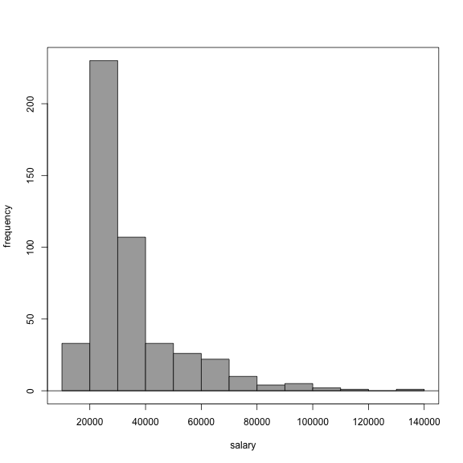

<!-- R Commander Markdown Template -->

Example Session
=======================

### Your Name

### 2016-02-09


```r
> library(foreign, pos=15)
```


```r
> Example <- read.spss("/Users/neildiamond/Desktop/Employee data.sav", 
+   use.value.labels=TRUE, max.value.labels=Inf, to.data.frame=TRUE)
```

```
Warning in read.spss("/Users/neildiamond/Desktop/Employee data.sav",
use.value.labels = TRUE, : /Users/neildiamond/Desktop/Employee data.sav:
Unrecognized record type 7, subtype 18 encountered in system file
```

```r
> colnames(Example) <- tolower(colnames(Example))
```


```r
> with(Example, Hist(salary, scale="frequency", breaks="Sturges", 
+   col="darkgray"))
```




```r
> with(Example, Hist(salary, groups=gender, scale="frequency", 
+   breaks="Sturges", col="darkgray"))
```


```r
> RegModel.1 <- lm(salary~jobtime, data=Example)
> summary(RegModel.1)
```

```

Call:
lm(formula = salary ~ jobtime, data = Example)

Residuals:
   Min     1Q Median     3Q    Max 
-19774 -10209  -5502   2682  98455 

Coefficients:
            Estimate Std. Error t value Pr(>|t|)    
(Intercept) 22843.32    6362.21   3.590 0.000365 ***
jobtime       142.72      77.84   1.833 0.067366 .  
---
Signif. codes:  0 '***' 0.001 '**' 0.01 '*' 0.05 '.' 0.1 ' ' 1

Residual standard error: 17030 on 472 degrees of freedom
Multiple R-squared:  0.007072,	Adjusted R-squared:  0.004968 
F-statistic: 3.362 on 1 and 472 DF,  p-value: 0.06737
```


```r
> t.test(salary~gender, alternative='two.sided', conf.level=.95, 
+   var.equal=FALSE, data=Example)
```

```

	Welch Two Sample t-test

data:  salary by gender
t = -11.688, df = 344.26, p-value < 2.2e-16
alternative hypothesis: true difference in means is not equal to 0
95 percent confidence interval:
 -18003.00 -12816.73
sample estimates:
mean in group Female   mean in group Male 
            26031.92             41441.78 
```


```r
> Boxplot(salary~gender, data=Example, id.method="y")
```


```
 [1] "371" "348" "468" "240" "72"  "80"  "168" "413" "277" "134" "18" 
[12] "29"  "32"  "34"  "103" "106" "343" "431" "446" "454"
```


